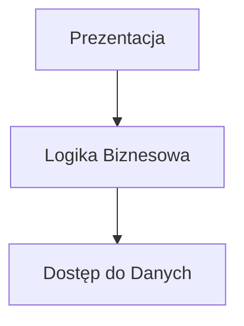

# To-Do List Manager

## Cel aplikacji
Celem aplikacji jest umożliwienie użytkownikowi:
- dodawania zadań,
- usuwania zadań,
- filtrowania zadań według statusu,
- przechowywania danych w pliku tekstowym.

---

# To-Do List Manager

### Diagram warstw (Mermaid)

---

### Opis przepływu danych między warstwami
1. Użytkownik wpisuje nowe zadanie w interfejsie (UI).  
2. UI wywołuje metodę `dodajZadanie()` w warstwie logiki biznesowej.  
3. Logika biznesowa sprawdza poprawność danych i przekazuje je do warstwy dostępu do danych (`BazaDanych.zapiszDoPliku()`).  
4. Zadanie zostaje zapisane w pliku `tasks.txt`.  
5. UI może ponownie wywołać `wyswietlZadania()`, które pobiera dane poprzez logikę biznesową (`ZarzadzanieZadaniami.odczytajZPliku()`) i wyświetla użytkownikowi.

---

### Warstwy aplikacji i przykładowe metody

#### 1. Prezentacja (UI)
- `wyswietlZadania()` – wyświetla listę zadań  
- `dodajZadanie()` – odbiera dane od użytkownika i wysyła do logiki biznesowej  
- `usunZadanie()` – przekazuje informację o usunięciu zadania  

#### 2. Logika Biznesowa
- `dodajZadanie(tresc)` – dodaje nowe zadanie do listy  
- `usunZadanie(id)` – usuwa zadanie po identyfikatorze  
- `filtrujZadania(status)` – filtruje zadania wg statusu  
- `edytujZadanie(id, nowaTresc)` – zmienia treść zadania  

#### 3. Dostęp do Danych (Data Access)
- `zapiszDoPliku(listaZadan)` – zapisuje wszystkie zadania do pliku  
- `odczytajZPliku()` – odczytuje listę zadań z pliku  
- `aktualizujZadanie(id, nowaTresc)` – aktualizuje dane w pliku  
- `usunZadanie(id)` – usuwa zadanie z pliku

---

### Wnioski
- Architektura warstwowa pozwala oddzielić logikę od prezentacji i dostępu do danych.  
- Dokumentacja i diagram Mermaid ułatwiają wizualizację przepływu danych.  
- Kod staje się bardziej czytelny i łatwiejszy do rozbudowy.